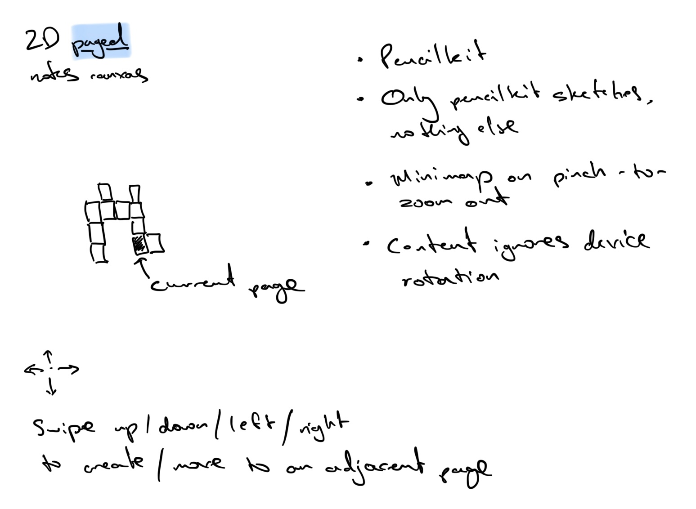

# Concept

I felt inspired by seeing this [Quick Journal](https://apps.apple.com/gb/app/quick-journal-just-write/id6554003659) app. Decided to finally try and create a simple pencil-first app I’ve been wanting for ages.

Inspired by Scapple, Muse, paper notebooks.

- Apple Notes paper but in a good...
- 2D grid of fixed-size dot grid pages. Navigate between them by swiping.
- Map view accessible via pinch-to-zoom gesture.
- Only pencil input - no text, nothing else.
- Nothing gets in the way of writing & sketching - no zooming, content ignores device rotation.

The first sketch in Apple Notes:

# Branches

- main: personal notes and sketches
- work-notes: work notes and sketches
- dev: stuff for dev and testing which I don’t mind losing

Each branch has a custom Bundle ID and Display Name to keep their data separate on iPadOS.

